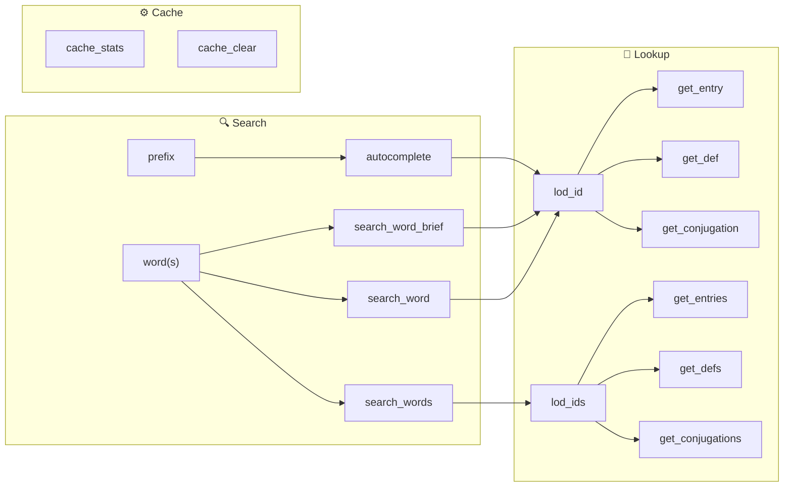

<div align="center">
  
  <h1>LOD-MCP</h1>
  <p><strong>A token-optimized MCP server for the Luxembourgish Online Dictionary</strong></p>
  <p>
    Look up Luxembourgish words in the <a href="https://lod.lu">LOD</a> dictionary
    from any MCP-compatible AI tool — search, look up, conjugate, and cache,
    all shaped to cost the model as few tokens as possible.
  </p>
  <p>
    <a href="https://modelcontextprotocol.io"></a>
    <a href="https://www.python.org/downloads/"></a>
    <a href="https://docs.astral.sh/uv/"></a>
    
    <a href="https://lod.lu/api/doc"></a>
  </p>
</div>

---

## Quick Start

**Prerequisites:** [uv](https://docs.astral.sh/uv/getting-started/installation/) and Python 3.13+

```bash
git clone https://github.com/OpenSprooch/lod-mcp
cd lod-mcp
./install.sh          # uv venv + install + test
```

Then add to **Claude Desktop** (`~/Library/Application Support/Claude/claude_desktop_config.json`):

```json
{
  "mcpServers": {
    "lod-mcp": {
      "command": "/path/to/lod-mcp/run-mcp.sh"
    }
  }
}
```

Restart Claude (Cmd+Q → reopen) and you're done.

<details>
<summary>Manual installation</summary>

```bash
uv venv .venv --python 3.13
uv pip install --python .venv/bin/python -e .
```

Create `run-mcp.sh`:
```bash
#!/bin/bash
export PYTHONUNBUFFERED=1
exec /path/to/lod-mcp/.venv/bin/lod-mcp
```
`chmod +x run-mcp.sh`
</details>

## Tools

All tools follow a simple two-step flow — **search** for a word to get an ID, then **look up** that ID for details:



| Tool | What it does | Key params |
|------|-------------|------------|
| `search_word` | Find words → list of LOD IDs | `word`, `max_results` |
| `search_word_brief` | Find words → `{id: "word (POS)"}` | `word`, `max_results` |
| `search_words` ⭐ | Batch search multiple words | `words[]`, `max_results` |
| `autocomplete` | Type-ahead suggestions | `prefix`, `limit` |
| `get_entry` | Full entry details | `lod_id`, `langs`, `max_examples` |
| `get_entries` ⭐ | Batch entry details | `lod_ids[]`, `langs`, `max_examples` |
| `get_def` | Single-language definition string | `lod_id`, `lang` |
| `get_defs` ⭐ | Batch definitions | `lod_ids[]`, `lang` |
| `get_conjugation` | Verb conjugation table | `lod_id` |
| `get_conjugations` ⭐ | Batch conjugations | `lod_ids[]` |
| `cache_stats` | Cache hit/miss stats | — |
| `cache_clear` | Clear cache | — |

⭐ = prefer these over calling single-word tools in a loop — fewer tool calls and tokens.

### Quick Examples

```
# Search
search_word("haus")              → ["HAUS1", "HAUSEN1"]
search_word_brief("haus")        → {"HAUS1": "Haus (N)", "HAUSEN1": "hausen (V)"}
autocomplete("ha", limit=3)      → "haus, hausen, hausfrau"

# Look up
get_def("HAUS1", "en")           → "Haus: house building; house household, family"
get_entry("GOEN1", langs="en")   → {id, w, pos, ipa, tr, ex, infl, audio …}
get_conjugation("GOEN1")         → {inf, pp, aux, ind, cnd, imp …}

# Batch (recommended for multiple words)
search_words(["haus","schoul"])  → {"haus": {"HAUS1": "Haus (N)"}, "schoul": {"SCHOUL1": "Schoul (N)"}}
get_defs(["HAUS1","SCHOUL1"])    → {"HAUS1": "Haus: house …", "SCHOUL1": "Schoul: school …"}
```

## Troubleshooting

- **Install failed?** — make sure [uv](https://docs.astral.sh/uv/) is installed and Python 3.13+ is available
- **Server won't start?** — test manually: `./run-mcp.sh` should output JSON
- **Import errors?** — reinstall: `uv pip install --python .venv/bin/python -e .`
- **Start fresh:** `./uninstall.sh && ./install.sh`

## Details

- **Cache** — 1-hour TTL, reduces duplicate API calls
- **Rate-limited** — 100ms between requests, respects the LOD API
- **Languages** — German, French, English, Portuguese, Dutch
- **Source** — [LOD API](https://lod.lu/api/doc) by the Luxembourgish Ministry of Culture

<div align="center">
  <sub>Part of <a href="https://github.com/OpenSprooch">OpenSprooch</a> — Luxembourgish-language tooling.</sub>
</div>

MIT License
